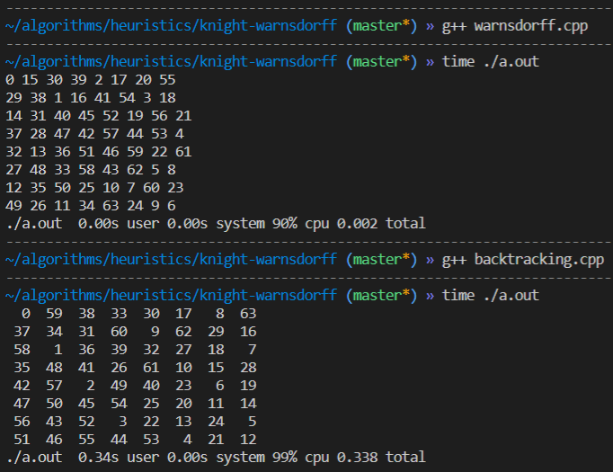

# Adicionando Heurística em algorítmos de backtracking

Para diminuir substancialmente o tempo de execução dos algorítmos de backtracking, podemos utilizar de heurísticas como a de Warnsdorff para o problema Knights Tour ou a heurística A\* que usaremos para outro problema.

Para fazer o comparativo de tempo de execução entre algorítmos, usaremos a ferramenta `time`, nativa dos sistemas Linux que permite medir o tempo de execução de um programa.

## Knights Tour

Para o problema Knights Tour assumimos que o cavalo inicia-se sempre na posição (0, 0). Podemos ver pela imagem abaixo que o uso da heurística Warnsdorff para o problema Knights Tour é bastante eficiente. reduzindo o tempo de execução de `0.338` para `0.002`.

